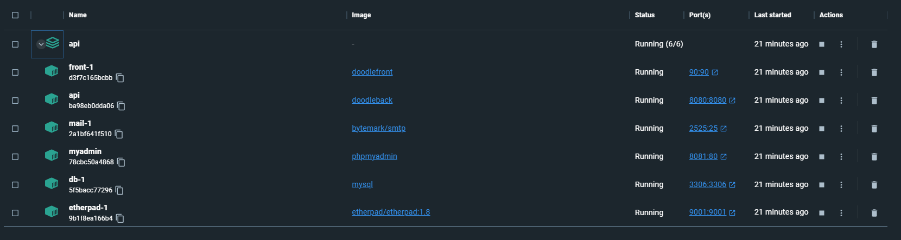

# YOANN ROUET
# Etat de l'application

L'application est correctement dockerisé et peut se lancer en local. 

Les problèmes sur les serveurs de l'istic ne m'ont pas permit d'aller plus loin sur le déploiement sur vm.

# Lancement de l'application (windows)

1) Lancer Docker Desktop

2) aller dans le dossier /front/ :

    docker build . -t doodlefront -f Dockerfile

3) aller dans le dossier /api/ :

    docker build . -t doodleback -f Dockerfile.native.x64

4) toujours dans le dossier /api/ :

    docker compose build up -d

---

L'application est disponible à l'adresse : http://localhost:90/

Etherpad est disponible à l'adresse : http://localhost:9001/

La partie phpmyadmin est disponible à l'adresse : http://localhost:8081/

L'api est disponible à l'adresse : http://localhost:8080/

---

# Architecture de déploiement

